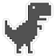

<p align="center">
  <a href="" rel="noopener">
 </a>
</p>
<h1 align="center">teachable dinosaur</h1>


<div align="center">
	


</div>

<h4 align="center">Dinosaur game, but with a bit of computer vision</h4>

<hr>

<p align="center">

</p>

<h2>How to use:</h2>

Clone this repsitory using the following command:
```
git clone https://github.com/sushantPatrikar/teachable-dinosaur.git
```

After cloning, run "train.py" file
When you run the file, an opencv frame will pop up, here you have to give the dataset for training.
Make a gesture with which you will tell the dinosaur to run. For example, in my case, it was a closed fist. When you are ready with the gesture, press the 's' key on your keyboard. This will take 1000 burst shots of your gesture.

After this step, the similar opencv window will pop up, now make another gesture that will tell the dinosaur to jump. In my case, it was the open palm. Again press 's' key on your keyborad when you are ready. This will take another 1000 burst shot. 

After doing this, the program will train the convolutional neural network on your dataset. Once the cnn is trained you will have a new file "weights.h5"

Now you are ready to play the game. Run "game.py" and enjoy!
